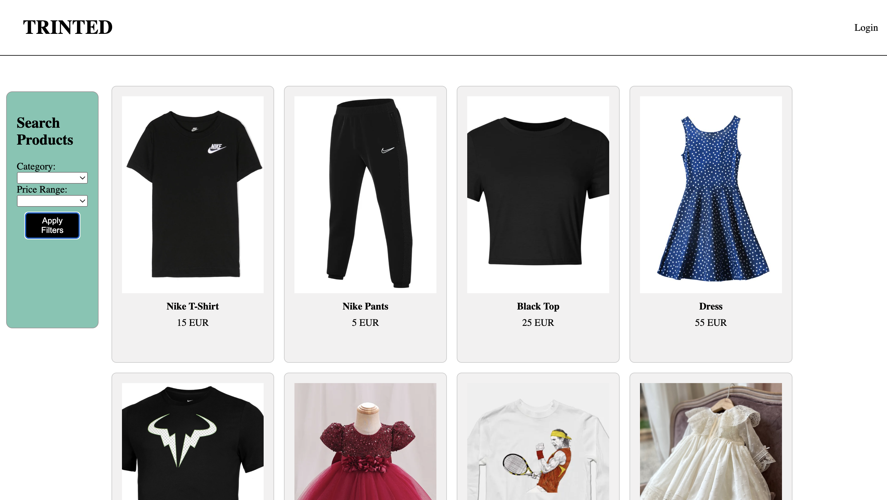
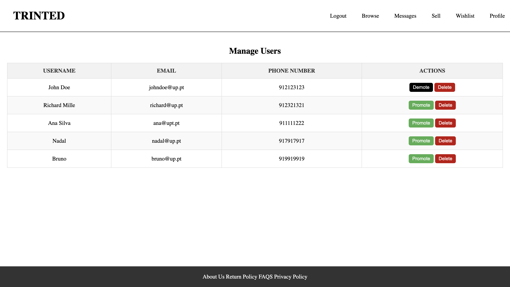

# Web Languages & Technologies

# TRINTED

## Group ltw04g01

- João Correia | up202005015 | 50%
- Miguel Figueiredo | up201706105 | 50%

## Install Instructions

    git clone https://github.com/joaocorreia04/Web_Languages_-_Technologies.git
    php -S localhost:9000

    Note: Database is already povoated with some examples (items, users, messages)

## Credentials

admin -> username: John Doe | password: 123456789 

user -> username: Richard Mille | password: 123456789

user -> username: Ana Silva | password: 123456789

user -> username: Nadal | password: 123456789

user -> username: Bruno | password: 123456789

## Screenshots

### Profile Page

### Browse Page

### Admin Page

## Implemented Features

**General**:

- [X] Register a new account.
- [X] Log in and out.
- [X] Edit their profile, including their name, username, password, and email.

**Sellers**  should be able to:

- [X] List new items, providing details such as category, brand, model, size, and condition, along with images.
- [X] Track and manage their listed items.
- [X] Respond to inquiries from buyers regarding their items and add further information if needed.
- [] Print shipping forms for items that have been sold.

**Buyers**  should be able to:

- [X] Browse items using filters like category, price, and condition.
- [X] Engage with sellers to ask questions or negotiate prices.
- [X] Add items to a wishlist or shopping cart.
- [X] Proceed to checkout with their shopping cart (simulate payment process).

**Admins**  should be able to:

- [X] Elevate a user to admin status.
- [X] Introduce new item categories, sizes, conditions, and other pertinent entities.
- [X] Oversee and ensure the smooth operation of the entire system.

**Security**:
We have been careful with the following security aspects:

- [X] **SQL injection**
- [ ] **Cross-Site Scripting (XSS)**
- [ ] **Cross-Site Request Forgery (CSRF)**

**Password Storage Mechanism**: hash_password&verify_password
